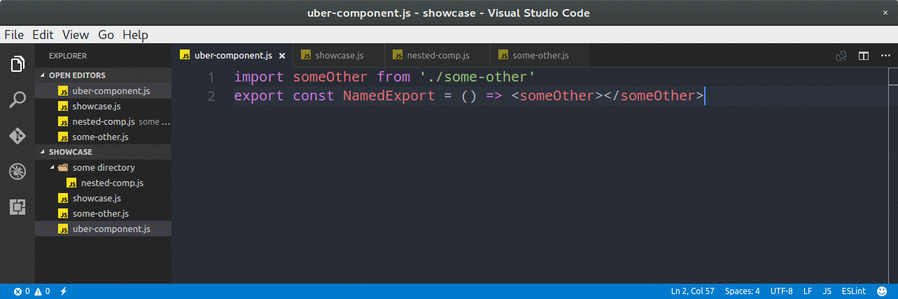
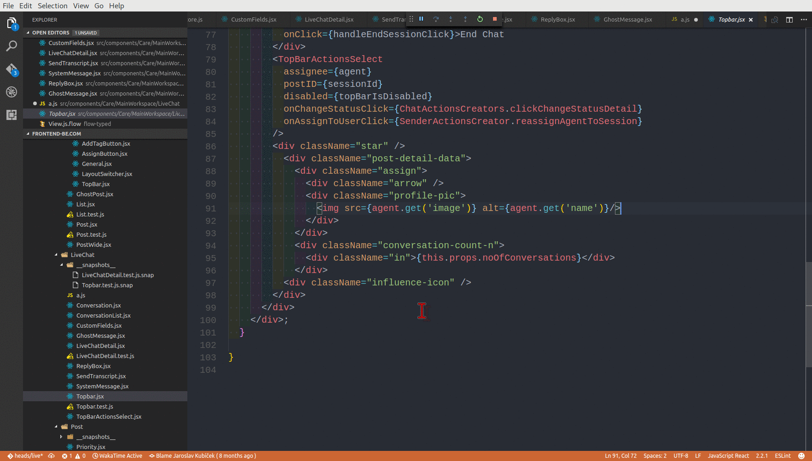

# vscode-exports-autocomplete

   

## Showcase

## Features
Collects ES6 exports from your project and autocompletes them. Upon completion, item is also imported using a relative path. Import is placed after last import in that file.

Generated import has no semicolon when you have a `standard` package in your `package.json` devDependencies. If you have eslint, it should pick up it's semicolon config and insert/omit semicolon accordingly to what you have set.

Of course it works even with huge projects which contain thousands of JS files. All JS/JSX files are parsed and cached on startup, then vscode internal file watcher is used to observe changed files.

We also parse ES6 files in node_modules-just the roots. For example if you have redux package in your `dependencies`, we will parse [this file](https://github.com/reactjs/redux/blob/master/src/index.js) giving us exactly the exports we want. So if you're a lib author, don't forget to add `module` property to your package.json.

Another nifty feature is adding imports when you copy a block of code, see:

## Usage inside JSX

Since VSCode does have it's own JSX support, there are some usability choices made to complement that.

If you're writing a component WITH children, you need to write a pair. Utilize a vscode's feature that will make any text into a JSX opening and closing pair when you hit a TAB key. Like this:

TODO add gif

If you're writing a component WITHOUT children, start by typing `<`. When you choose autocomplete, plugin will automatically close the tag for you. Like this:

TODO add gif

## Extension Settings

This extension has the following settings:

* `vscode-exports-autocomplete.enable`: enable/disable this extension
* `vscode-exports-autocomplete.addImportsOnPaste`: set this to false when you're annoyed by import tokens being added on paste
* `vscode-exports-autocomplete.minimumWordLengthToImportOnPaste`: set this to a higher value if 'on paste' is too aggressive for you
* `vscode-exports-autocomplete.enableNpmDependencies`: set this to false when you're annoyed by the stuff you get from your npm modules
* `vscode-exports-autocomplete.indentationOverride`: string to be used when indenting, default is two spaces, for doublequote use "\""
* `vscode-exports-autocomplete.quoteCharOverride`: string to be used when writing string literals, default is single quote
* `vscode-exports-autocomplete.cacheSizeLimit`: size limit for the cache of parsed exports, parsed with bytes npm package, shared among all projects, default "25MB"

You need to restart VSCode for the changes to take effect.